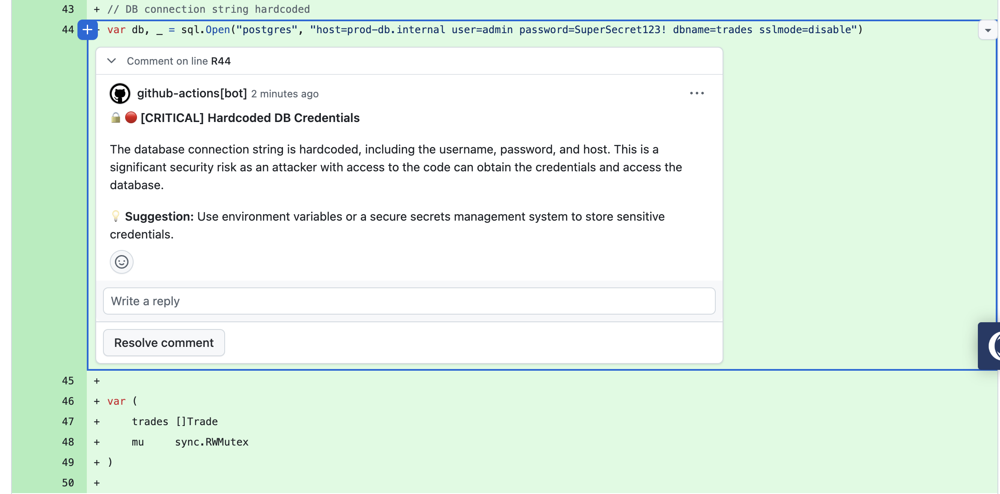

# Code Review Ninja 🥷

Multi-agent AI code review bot powered by **LangGraph** — supports **Groq** (free), **OpenAI**, **Anthropic**, **Ollama** (local), and **Google Gemini**.

Four specialist agents analyze every PR for security vulnerabilities, performance issues, style violations, and missing documentation — then aggregate findings into a single formatted review comment.

```
Security Agent → Performance Agent → Style Agent → Docs Agent → Aggregator
```

## Screenshots

### Inline PR Review Comments

The bot posts inline comments directly on the relevant lines of the PR diff, highlighting issues with severity and actionable suggestions:




## Supported Providers

| Provider | Default Model | API Key Env Var | Free Tier |
|----------|--------------|-----------------|-----------|
| **Groq** (default) | `llama-3.3-70b-versatile` | `GROQ_API_KEY` | ✅ 100K tokens/day |
| **OpenAI** | `gpt-4o` | `OPENAI_API_KEY` | ❌ |
| **Anthropic** | `claude-sonnet-4-20250514` | `ANTHROPIC_API_KEY` | ❌ |
| **Ollama** | `llama3.1` | None (local) | ✅ Unlimited |
| **Gemini** | `gemini-2.0-flash` | `GOOGLE_API_KEY` | ✅ Free tier available |

Switch providers by setting `LLM_PROVIDER` in `.env`:
```bash
LLM_PROVIDER=openai    # or groq, anthropic, ollama, gemini
```

Install the extras for your chosen provider:
```bash
uv sync                         # Groq (included by default)
uv sync --extra openai          # + OpenAI
uv sync --extra anthropic       # + Anthropic
uv sync --extra ollama          # + Ollama
uv sync --extra gemini          # + Google Gemini
uv sync --extra all             # All providers
```

## Quick Start

```bash
# 1. Clone and install
git clone https://github.com/Fahadulhassan1/code_review_ninja.git
cd code_review_ninja
uv sync

# 2. Configure your provider
cp .env.example .env
# Edit .env — add your API key (GROQ_API_KEY by default)
# Optional: set LLM_PROVIDER=openai/anthropic/ollama/gemini

# 3. Run a demo review
uv run python -m code_review --demo
```

## Usage

```bash
# Just paste a GitHub PR link — that's it
uv run python -m code_review https://github.com/owner/repo/pull/42

# Post the review as a comment on the PR
uv run python -m code_review https://github.com/owner/repo/pull/42 --post

# Review a local diff (pipe from git)
git diff main | uv run python -m code_review --stdin

# Run the demo with sample Go code (SQL injection, command injection, O(n²))
uv run python -m code_review --demo
```

The `--repo`/`--pr` flags still work for CI scripts:
```bash
uv run python -m code_review --repo owner/repo --pr 42 --post
```

## Specialist Agents

| Agent | Focus |
|-------|-------|
| 🔒 Security | SQL injection, command injection, auth issues, OWASP Top 10 |
| ⚡ Performance | N+1 queries, O(n²) algorithms, goroutine leaks, missing timeouts |
| 🎨 Style | Idiomatic Go/Python, error handling patterns, naming conventions |
| 📝 Documentation | Missing godoc, undocumented interfaces, unclear logic |

## Use it in your repo

### Option A: GitHub Actions (zero setup)

Add automatic AI reviews to any repo in 2 steps:

1. Copy `.github/workflows/code-review.yml` into your repo
2. Add your provider's API key as a repository secret (Settings → Secrets → Actions)

| Provider | Required Secret(s) |
|----------|--------------------|
| Groq free (default) | `GROQ_API_KEY` |
| Groq paid | `GROQ_API_KEY` + `GROQ_RATE_LIMIT` = `0` |
| OpenAI | `OPENAI_API_KEY` + `LLM_PROVIDER` = `openai` |
| Anthropic | `ANTHROPIC_API_KEY` + `LLM_PROVIDER` = `anthropic` |
| Gemini | `GOOGLE_API_KEY` + `LLM_PROVIDER` = `gemini` |

That's it. Every PR will get an AI review comment automatically. The workflow auto-installs the right provider package and pulls the bot from `Fahadulhassan1/code_review_ninja` — no fork needed.

### Option B: Docker (self-hosted webhook server)

Run the review bot as a service that auto-reviews PRs across multiple repos:

```bash
# Build
docker build -t code-review-bot .

# Run (Groq — default)
docker run -d \
  -e GROQ_API_KEY=gsk_your_key \
  -e GITHUB_TOKEN=ghp_your_token \
  -p 8000:8000 \
  code-review-bot

# Run (OpenAI example)
docker run -d \
  -e LLM_PROVIDER=openai \
  -e OPENAI_API_KEY=sk-your_key \
  -e GITHUB_TOKEN=ghp_your_token \
  -p 8000:8000 \
  code-review-bot
```

Then add a webhook in each GitHub repo:
- **Payload URL:** `https://your-server.com/webhook/github`
- **Content type:** `application/json`
- **Events:** Pull requests only

See [Webhook Server](#webhook-server) below for full setup.

### Option C: CLI (one-off reviews)

```bash
git clone https://github.com/Fahadulhassan1/code_review_ninja.git
cd code_review_ninja && uv sync
cp .env.example .env  # add your provider's API key

uv run python -m code_review https://github.com/owner/repo/pull/42
```

## Webhook Server

The webhook server lets GitHub automatically trigger reviews on every PR event (open, push, reopen) — no manual commands needed.

### Setup

**1. Start the server**

```bash
# With Docker (recommended)
docker run -d -e LLM_PROVIDER=groq -e GROQ_API_KEY=... -e GITHUB_TOKEN=... -p 8000:8000 code-review-bot

# Or without Docker
uv run uvicorn code_review.server:app --host 0.0.0.0 --port 8000
```

**2. Expose it to the internet** (if running locally)

Use [ngrok](https://ngrok.com), [Cloudflare Tunnel](https://developers.cloudflare.com/cloudflare-one/connections/connect-networks/), or deploy to a cloud VM.

```bash
# Example with ngrok
ngrok http 8000
# → Forwarding https://abc123.ngrok.io → http://localhost:8000
```

**3. Configure the GitHub webhook**

Go to your repo → **Settings** → **Webhooks** → **Add webhook**:

| Field | Value |
|-------|-------|
| Payload URL | `https://your-server.com/webhook/github` |
| Content type | `application/json` |
| Secret | *(optional but recommended — set the same value as `GITHUB_WEBHOOK_SECRET` in `.env`)* |
| Events | Select **Pull requests** only |

**4. That's it!** Every PR opened or updated in that repo will be auto-reviewed and the bot posts a comment.

### Endpoints

| Method | Path | Description |
|--------|------|-------------|
| `GET` | `/health` | Health check (returns version + timestamp) |
| `POST` | `/webhook/github` | GitHub webhook receiver (auto-triggered) |
| `POST` | `/review` | Manual trigger: `{ "repo": "owner/repo", "pr": 42 }` |

### Security

Set `GITHUB_WEBHOOK_SECRET` in `.env` to enable HMAC-SHA256 signature verification. The server will validate every incoming webhook payload against this secret.

## Testing

```bash
# Run all tests (unit + integration)
uv run python tests/test_code_review.py

# Unit tests don't require API keys; integration tests need your provider's API key
```

## Rate Limiting

Groq's free tier has strict rate limits. The bot throttles requests by default (25 req/min) to avoid hitting them.

| Scenario | Setting |
|----------|--------|
| Groq free tier | Default (`GROQ_RATE_LIMIT=25`) — no change needed |
| Groq paid plan | Set `GROQ_RATE_LIMIT=0` to disable throttling |
| OpenAI / Anthropic / Gemini / Ollama | No rate limiting applied (not needed) |

Set via `.env` for CLI/Docker, or as a GitHub Actions secret for workflows.

## Project Structure

```
agentic/
├── code_review/
│   ├── __init__.py
│   ├── __main__.py               # python -m code_review entry point
│   ├── llm.py                    # Multi-provider LLM config (Groq/OpenAI/Anthropic/Ollama/Gemini)
│   ├── state.py                  # ReviewState, FileDiff, ReviewFinding models
│   ├── agents.py                 # 4 specialist agents + aggregator (with retry)
│   ├── graph.py                  # LangGraph sequential orchestration
│   ├── github_client.py          # GitHub API (fetch diffs, post comments)
│   ├── server.py                 # FastAPI webhook server (async, validated)
│   └── cli.py                    # CLI for local & CI usage
├── tests/
│   └── test_code_review.py       # Unit + integration tests
├── .github/workflows/
│   └── code-review.yml           # GitHub Action workflow
├── Dockerfile                    # Docker image for webhook server
├── .env.example                  # Environment variables template
├── pyproject.toml                # Dependencies (uv)
└── README.md
```

## Tech Stack

| Component | Tool |
|-----------|------|
| LLM | Groq, OpenAI, Anthropic, Ollama, Gemini (configurable) |
| Agent Framework | LangGraph |
| Web Framework | FastAPI |
| GitHub API | PyGithub |
| Python | 3.12+ with uv |

## License

MIT
